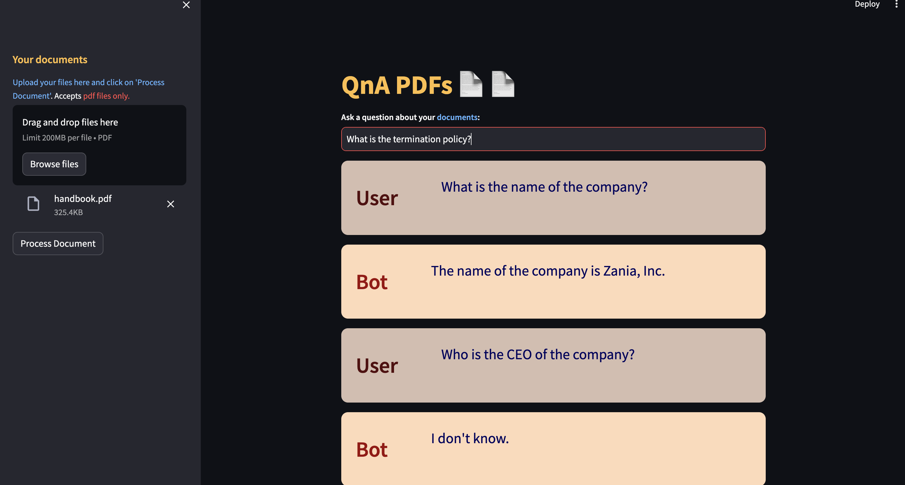
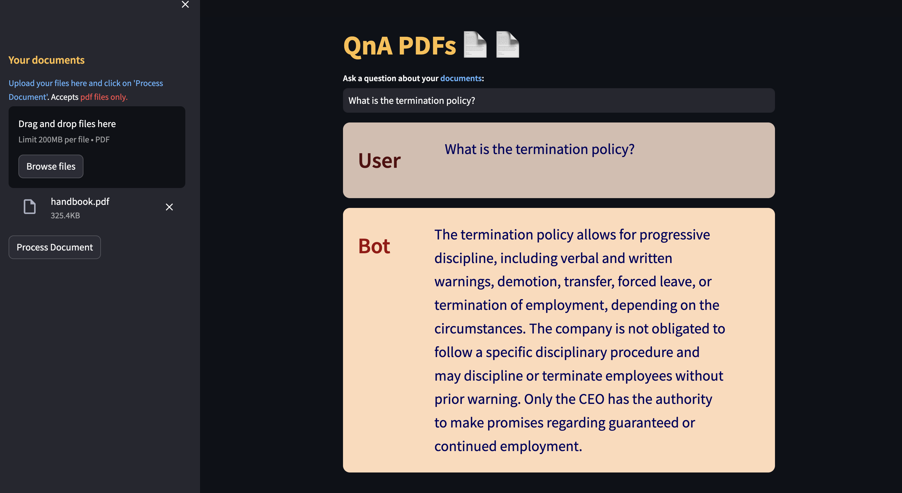

### README.md


# PDF QnA Bot

This repository contains a Streamlit application that uses OpenAI's GPT-3.5-turbo model to answer questions based on the content of PDF documents. The application is containerized using Docker and uses Conda for dependency management.

## Features

- Extract text from PDF files
- Chunk text for processing
- Create a vector store using embeddings
- Use OpenAI GPT-3.5-turbo for question-answering
- Display answers in a Streamlit web application

## Prerequisites

- Docker installed on your machine
- OpenAI API key

## Project Structure

```
.
├── Dockerfile
├── README.md
├── environment.yml
├── .env
├── main.py
├── multidocs_palm.py
├── htmlTemplates.py
└── resources
    ├── image1.png
    └── image2.png
```

## Environment Variables

Create a `.env` file in the root directory of the project and add your OpenAI API key:

```
OPENAI_API_KEY=your_openai_api_key
```

Replace `your_openai_api_key` with your actual OpenAI API key.

## Installation

### Build the Docker Image

```sh
docker build -t streamlit-conda-app .
```

### Run the Docker Container

```sh
docker run -p 8501:8501 --env-file .env streamlit-conda-app
```

### Access the Application

Open your browser and navigate to `http://localhost:8501` to access the Streamlit application.

## Usage

1. **Upload PDFs**: Click on the "Choose a PDF file" button to upload one or more PDF files.
2. **Ask Questions**: Enter your questions in the text input box.
3. **Get Answers**: The bot will process the PDFs and provide answers based on the content.

## Images

Here are some images showing the bot in action:

### Bot Working - Step 1


### Bot Working - Step 2



## Contributing

Feel free to open issues or submit pull requests with improvements.

## License

This project is licensed under the MIT License. See the LICENSE file for details.
